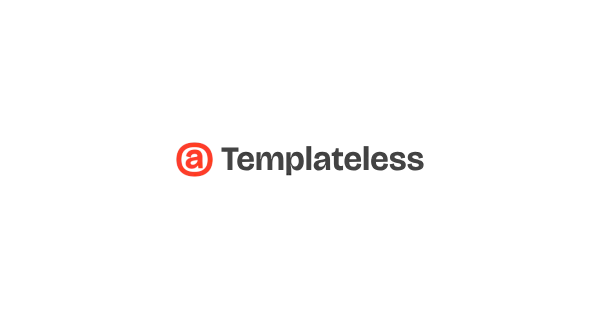

<h1 align="center">
  <a href="https://templateless.com/">
    
  </a>
  <br />
</h1>

<p align="center">
  <b>Ship faster by treating email as code 🚀</b> <br />
</p>

<h4 align="center">
  <a href="https://templateless.com/">Website</a> &bull;
  <a href="https://app.templateless.com/">Get Your API Key</a> &bull;
  <a href="https://twitter.com/templateless">Twitter</a>
</h4>

---

[](https://crates.io/crates/templateless)
[](https://github.com/templateless/templateless-rust/actions)
[](https://docs.rs/templateless/latest/templateless/)
[](https://crates.io/crates/templateless)
[](https://twitter.com/templateless)

[Templateless](https://templateless.com) lets you generate and send transactional emails quickly and easily so you can focus on building your product.

## ✨ Features

- 👋 **Anti drag-and-drop by design** — emails are a part of your code
- ✅ **Components as code** — function calls turn into email HTML components
- 💻 **SDK for any language** — use your favorite [programming language](https://github.com/orgs/templateless/repositories)
- 🔍 **Meticulously tested** — let us worry about email client compatibility
- 💌 **Use your favorite ESP** — Amazon SES, SendGrid, Mailgun + more
- 💪 **Email infrastructure** — rate-limiting, retries, scheduling + more
- ⚡ **Batch sending** — send 1 email or 1,000 with one API call

## 🚀 Getting started

Install via Cargo:

```bash
cargo add templateless
```

Or add manually to your `Cargo.toml`:

```toml
[dependencies]
templateless = "0.1"
```

## 👩‍💻 Quick example

This is all it takes to send a signup confirmation email:

```rust
use templateless::{Content, Email, EmailAddress, Templateless, Result};

#[tokio::main]
async fn main() -> Result<()> {
    let content = Content::builder()
        .text("Hi, please **confirm your email**:")
        .button("Confirm Email", "https://your-company.com/signup/confirm?token=XYZ")
        .build()?;

    let email = Email::builder()
        .to(EmailAddress::new("<YOUR_CUSTOMERS_EMAIL_ADDRESS>"))
        .subject("Confirm your signup 👋")
        .content(content)
        .build()?;

    let _result = Templateless::new("<YOUR_API_KEY>")
        .send(email)
        .await?;

    Ok(())
}
```

> [!NOTE]
> 🚧 **This SDK is not stable yet.** The API might change as more features are added. Please pay attention to the [CHANGELOG](CHANGELOG.md) for breaking changes.

Examples:

1. Get your **free API key** here: <https://app.templateless.com> ✨
1. There are more Rust examples in the [examples](examples) folder

## 💌 Components

Components located in the header and footer sections will have their own styling (and usually smaller text). Example:

```rust
  let header = Header::builder()
    .text("Smaller text")
    .build()?;
  
  let content = Content::builder()
    .text("Normal text")
    .build()?;
```

Currently there are 2 themes, `Theme::Unstyled` and `Theme::Simple`:

```rust
  let content = Content::builder()
    .theme(Theme::Simple)
    .text("Hello world")
    .build()?;
```

All of the following components can be mixed and matched to create dynamic emails:

<details>
  <summary>Text</summary>

Text component allow you to insert a paragraph. Each paragraph supports basic markdown:

- Bold text: `**bold text**`
- Italic text: `_italic text_`
- Link: `[link text](https://example.com)`
- Also a link: `<https://example.com>`
- Headers (h1-h6):

  - `# Big Header`
  - `###### Small Header`

```rust
Content::builder()
  .text("## Thank you for signing up")
  .text("Please **verify your email** by [clicking here](https://example.com/confirm?token=XYZ)")
  .build()?;
```

</details>
<details><summary>Link</summary>

Link component adds an anchor tag. This is the same as a text component with the link written in markdown:

```rust
Content::builder()
  .link("Confirm Email", "https://example.com/confirm?token=XYZ") // or...
  .text("[Confirm Email](https://example.com/confirm?token=XYZ)")
  .build()?;
```

</details>
<details><summary>Button</summary>

Button can also be used as a call to action.

> [!NOTE]
> Button color is set via your dashboard's app color.

```rust
Content::builder()
  .button("Confirm Email", "https://example.com/confirm?token=XYZ")
  .build()?;
```

</details>
<details><summary>Image</summary>

Image component will link to an image within your email.

> [!NOTE]
> Keep in mind that a lot of email clients will prevent images from being loaded automatically for privacy reasons.

```rust
Content::builder()
  .image(
    "https://example.com/image.jpg",  // where the image is hosted
    Some("https://example.com"),      // [optional] link url, if you want it to be clickable
    Some(200),                        // [optional] width
    Some(100),                        // [optional] height
    Some("Alt text"),                 // [optional] alternate text
  )
  .build()?;
```

Only the `src` parameter is required; everything else is optional.

**If you have "Image Optimization" turned on:**

1. Your images will be cached and distributed by our CDN for faster loading. The cache does not expire. If you'd like to re-cache, simply append a query parameter to the end of your image url.
1. Images will be converted into formats that are widely supported by email clients. The following image formats will be processed automatically:

    - Jpeg
    - Png
    - Gif
    - WebP
    - Tiff
    - Ico
    - Bmp
    - Svg

1. Maximum image size is 5MB for free accounts and 20MB for paid accounts.
1. You can specify `width` and/or `height` if you'd like (they are optional). Keep in mind that images will be scaled down to fit within the email theme, if they're too large.

</details>
<details><summary>One-Time Password</summary>

OTP component is designed for showing temporary passwords and reset codes.

```rust
Content::builder()
  .text("Here's your **temporary login code**:")
  .otp("XY78-2BT0-YFNB-ALW9")
  .build()?;
```

</details>
<details><summary>Social Icons</summary>

Every theme comes with easily linkable social icons to connect with your company's profiles. Usually, they're placed somewhere in the footer.

These are all the supported platforms:

```rust
Content::builder()
  .socials(vec![
    SocialItem::new(Service::Website, "https://example.com"),
    SocialItem::new(Service::Email, "username@example.com"),
    SocialItem::new(Service::Phone, "123-456-7890"), // `tel:` link
    SocialItem::new(Service::Facebook, "Username"),
    SocialItem::new(Service::YouTube, "ChannelID"),
    SocialItem::new(Service::Twitter, "Username"),
    SocialItem::new(Service::X, "Username"),
    SocialItem::new(Service::GitHub, "Username"),
    SocialItem::new(Service::Instagram, "Username"),
    SocialItem::new(Service::LinkedIn, "Username"),
    SocialItem::new(Service::Slack, "Org"),
    SocialItem::new(Service::Discord, "Username"),
    SocialItem::new(Service::TikTok, "Username"),
    SocialItem::new(Service::Snapchat, "Username"),
    SocialItem::new(Service::Threads, "Username"),
    SocialItem::new(Service::Telegram, "Username"),
  ])
  .build()?;
```

</details>
<details><summary>View in Browser</summary>

If you'd like your recipients to be able to read the email in a browser, you can add the "view in browser" component that will automatically generate a link.

Usually, this is placed in the header or footer of the email.

> [!NOTE]
> This will make the email public to anyone that has access to the link.

```rust
Content::builder()
  .view_in_browser("Read Email in Browser")
  .build()?;
```

</details>

## 🤝 Contributing

- Contributions are more than welcome <3
- Please **star this repo** for more visibility ★

## 📫 Get in touch

- For customer support feel free to email us at [github@templateless.com](mailto:github@templateless.com)

- Have suggestions or want to give feedback? Here's how to reach us:

    - For feature requests, please [start a discussion](https://github.com/templateless/templateless-rust/discussions)
    - Found a bug? [Open an issue!](https://github.com/templateless/templateless-rust/issues)
    - We are also on Twitter: [@Templateless](https://twitter.com/templateless)

## 🍻 License

[MIT](LICENSE)